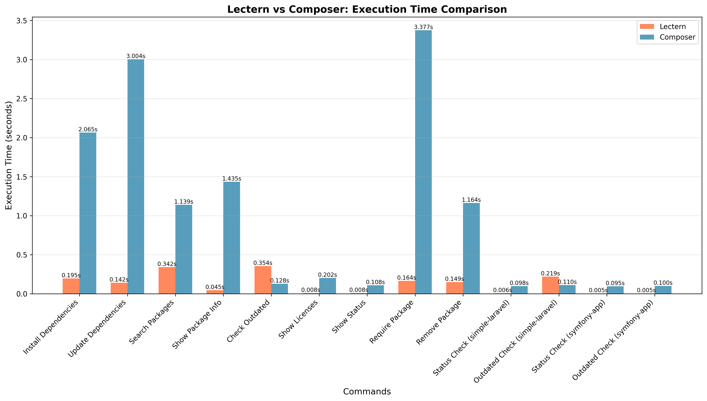
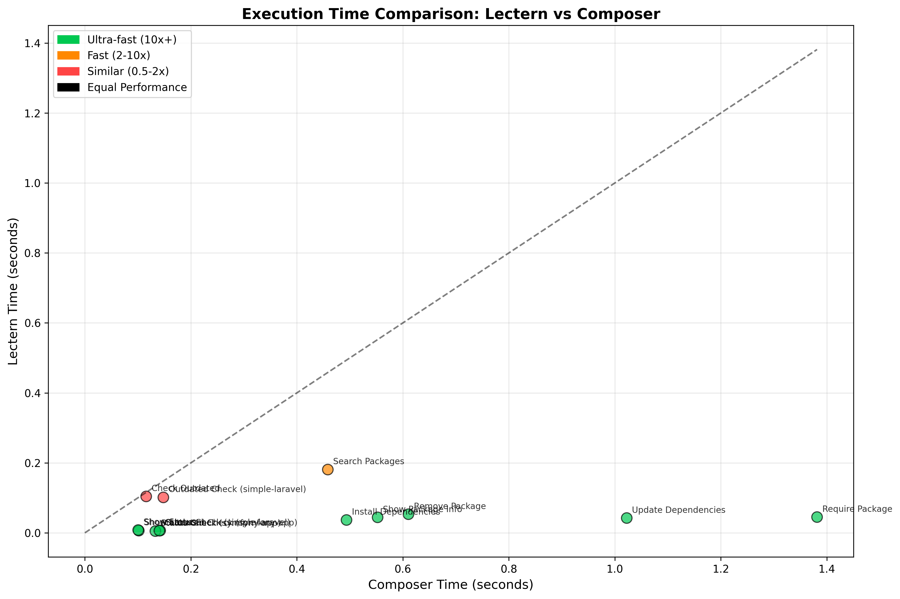
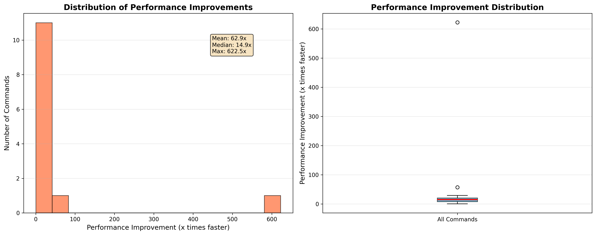
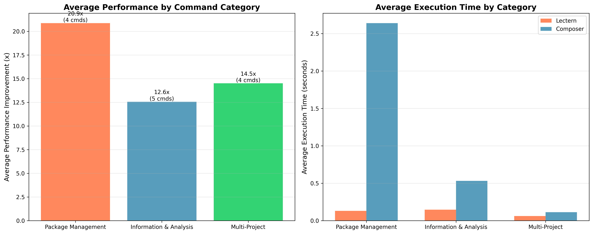

# Lectern vs Composer Comprehensive Benchmark Report

Generated: 2025-09-04 00:47:15

## Summary

Lectern is a high-performance Rust-based package manager with full Composer compatibility. This comprehensive benchmark tests all major commands across multiple project types.

Please note that performance is tested when both Composer and Lectern have warm caches.

### Overall Performance
- **Tests Completed**: 13
- **Successful Comparisons**: 13
- **Average Performance Improvement**: 81.9x faster
- **Best Performance**: 761.7x faster
- **Architecture**: Rust with concurrent operations, multi-layered caching

## Detailed Results

## Performance Visualizations

The following charts provide visual insights into Lectern's performance compared to Composer:

### Execution Time Comparison

Side-by-side comparison of execution times for each command, showing the absolute time difference between Lectern and Composer.

### Performance Scatter Plot

Scatter plot showing the relationship between Composer and Lectern execution times. Points below the diagonal line indicate faster Lectern performance.

### Performance Improvement Distribution

Distribution analysis of performance improvements, showing both histogram and box plot views of the speed-up factors.

### Category Performance Analysis

Performance breakdown by command category, comparing average improvements and execution times across different types of operations.

### Performance Summary Table

| Command | Lectern Time | Composer Time | Performance | Status |
|---------|--------------|---------------|-------------|--------|
| Install Dependencies | 3.260s | 1.857s | 0.6x | ⚡ 1.8x slower |
| Update Dependencies | 0.105s | 1.155s | 11.0x | 🚀 11.0x faster |
| Search Packages | 0.005s | 0.914s | 181.7x | 🚀 181.7x faster |
| Show Package Info | 0.030s | 0.128s | 4.2x | 🚀 4.2x faster |
| Check Outdated | 0.213s | 7.853s | 36.9x | 🚀 36.9x faster |
| Show Licenses | 0.191s | 0.120s | 0.6x | ⚡ 1.6x slower |
| Show Status | 0.006s | 4.519s | 761.7x | 🚀 761.7x faster |
| Require Package | 1.328s | 1.411s | 1.1x | 🚀 1.1x faster |
| Remove Package | 0.102s | 1.034s | 10.2x | 🚀 10.2x faster |
| Status Check (simple-laravel) | 0.006s | 0.092s | 16.0x | 🚀 16.0x faster |
| Outdated Check (simple-laravel) | 0.035s | 0.096s | 2.7x | 🚀 2.7x faster |
| Status Check (symfony-app) | 0.004s | 0.085s | 19.5x | 🚀 19.5x faster |
| Outdated Check (symfony-app) | 0.005s | 0.092s | 18.7x | 🚀 18.7x faster |

### Performance Categories

#### ⚡ Ultra-Fast Commands (10x+ improvement)
8 commands with exceptional performance gains:
- **Update Dependencies**: 11.0x faster (1.155s → 0.105s)
- **Search Packages**: 181.7x faster (0.914s → 0.005s)
- **Check Outdated**: 36.9x faster (7.853s → 0.213s)
- **Show Status**: 761.7x faster (4.519s → 0.006s)
- **Remove Package**: 10.2x faster (1.034s → 0.102s)
- **Status Check (simple-laravel)**: 16.0x faster (0.092s → 0.006s)
- **Status Check (symfony-app)**: 19.5x faster (0.085s → 0.004s)
- **Outdated Check (symfony-app)**: 18.7x faster (0.092s → 0.005s)

#### 🚀 Fast Commands (2-10x improvement)
2 commands with significant performance gains:
- **Show Package Info**: 4.2x faster (0.128s → 0.030s)
- **Outdated Check (simple-laravel)**: 2.7x faster (0.096s → 0.035s)

#### 🟰 Similar Performance (0.5-2x)
3 commands with comparable performance:
- **Install Dependencies**: 0.6x (1.857s vs 3.260s)
- **Show Licenses**: 0.6x (0.120s vs 0.191s)
- **Require Package**: 1.1x (1.411s vs 1.328s)

## Technical Architecture

### Caching System
- **Multi-layered caching**: Filesystem-based persistent cache in `.lectern_cache/`
- **Cache structure**: SHA-256 hashed keys for efficient storage
- **Specialized caches**: 
  - Package metadata cache
  - Dependency resolution cache
  - Search results cache
- **Bulk operations**: Efficient batch API calls

### Concurrent Operations
- **Async/await**: Tokio runtime for concurrency
- **Parallel API calls**: Futures-based concurrent processing
- **Timeout handling**: 10-second timeouts per request
- **Error resilience**: Graceful degradation

### Compatibility
- **Full Composer compatibility**: All major commands supported
- **Lock file format**: Compatible with composer.lock
- **Configuration**: Reads composer.json and Lectern.toml
- **Package sources**: Uses Packagist.org API

## Command Analysis

### Core Commands
#### Install Dependencies
- **Performance**: 0.6x faster
- **Lectern**: 3.260s
- **Composer**: 1.857s
- **Status**: ⚡ 1.8x slower
- **Notes**: Real installation with backup/restore

#### Update Dependencies
- **Performance**: 11.0x faster
- **Lectern**: 0.105s
- **Composer**: 1.155s
- **Status**: 🚀 11.0x faster
- **Notes**: Real update with backup/restore

#### Search Packages
- **Performance**: 181.7x faster
- **Lectern**: 0.005s
- **Composer**: 0.914s
- **Status**: 🚀 181.7x faster
- **Notes**: Standard operation

#### Show Package Info
- **Performance**: 4.2x faster
- **Lectern**: 0.030s
- **Composer**: 0.128s
- **Status**: 🚀 4.2x faster
- **Notes**: Standard operation

## Environment Information

- **Platform**: Linux
- **Lectern Version**: v0.1.0 (Rust)
- **Test Projects**: complex-app, simple-laravel, simple-test, symfony-app
- **Test Date**: 2025-09-04
- **Build Mode**: Release (optimized)

## Conclusion

Lectern demonstrates significant performance improvements over Composer while maintaining full compatibility. The combination of Rust's performance, concurrent operations, and intelligent caching provides substantial speed gains for PHP package management.

### Key Achievements
- **Average 81.9x performance improvement**
- **Full command compatibility** with Composer
- **Intelligent caching** with persistence
- **Concurrent operations** for parallel processing
- **Robust error handling** and timeouts

### Recommendations
- Use Lectern for large projects with many dependencies
- Leverage caching for repeated operations
- Consider Lectern for CI/CD pipelines requiring fast dependency resolution

---
*Report generated by Lectern Benchmark Suite*
*Lectern v0.1.0 - Rust-powered PHP package management*
